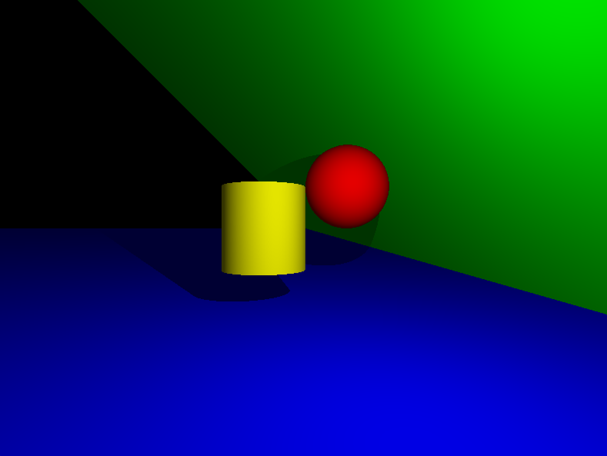
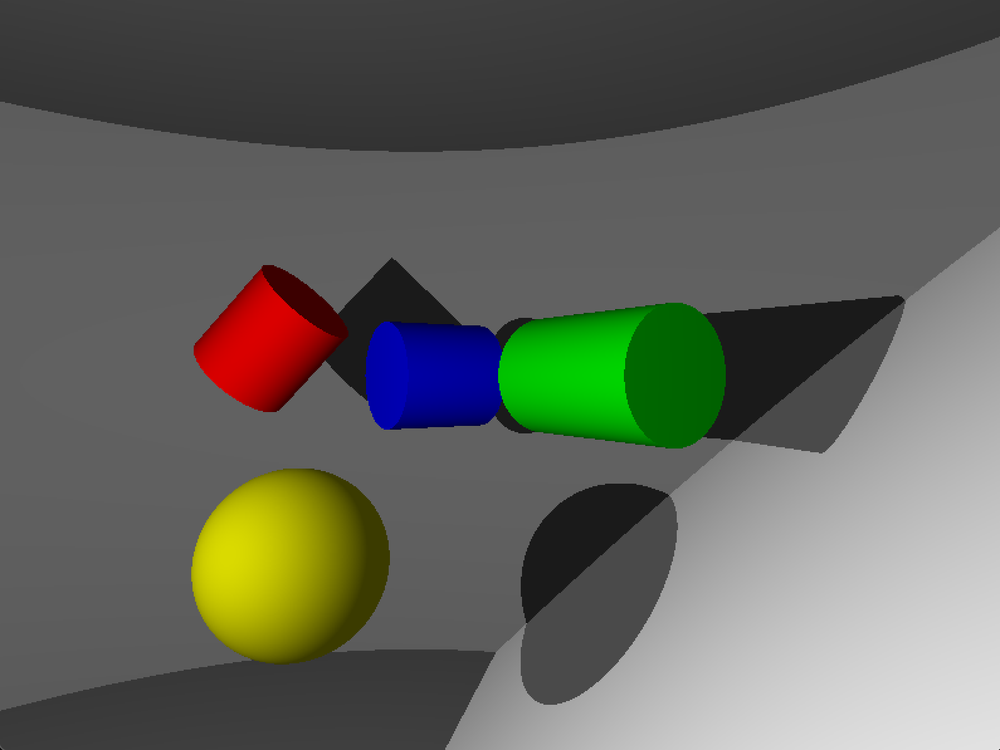
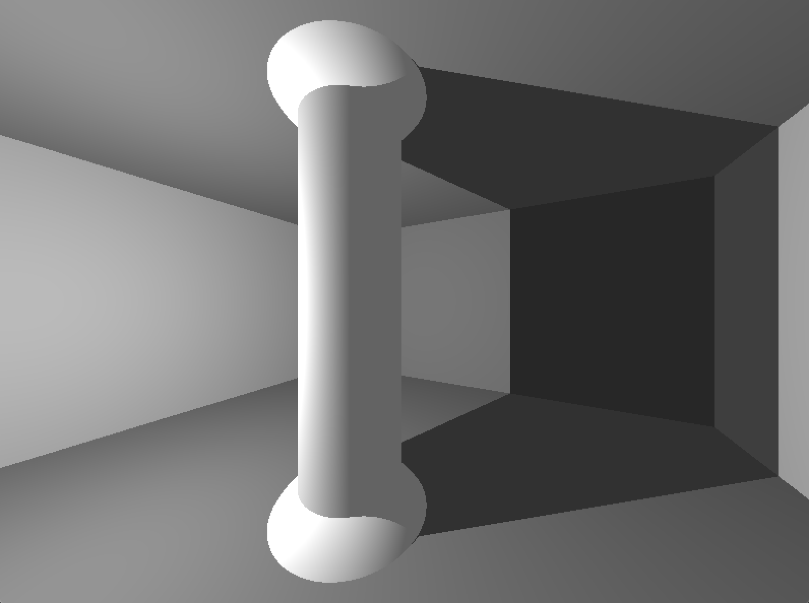
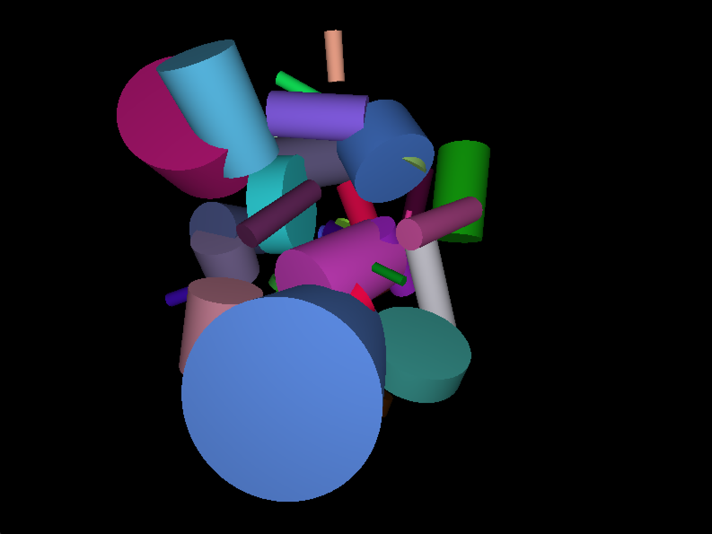

# miniRT

A lightweight ray tracer written in C for the 42 Common Core curriculum.

Implements scene parsing, ray-object intersections, shading, and a custom vector math library.

## Features

- Sphere, plane, cylinder intersection logic
- Custom scene parser (`.rt` format)
- Full vector math implementation

## What I learned

- Collaborating effectively with a teammate
- Expanding vector math and linear algebra intuition
- Designing a clean, modular architecture in C
- Debugging light artifacts (a special kind of hell)

## How to run

### Compile

```bash
# Adjust `LIBS` variables in the Makefile if needed, depending on your OS
make
```

### Run

```bash
# See the sample scenes in `scenes/`
./miniRT *.rt
```

## Gallery

<table align="center">
  <tr>
    <td></td>
    <td></td>
    <td></td>
  </tr>
  <tr>
    <td></td>
    <td></td>
    <td></td>
  </tr>
</table>
